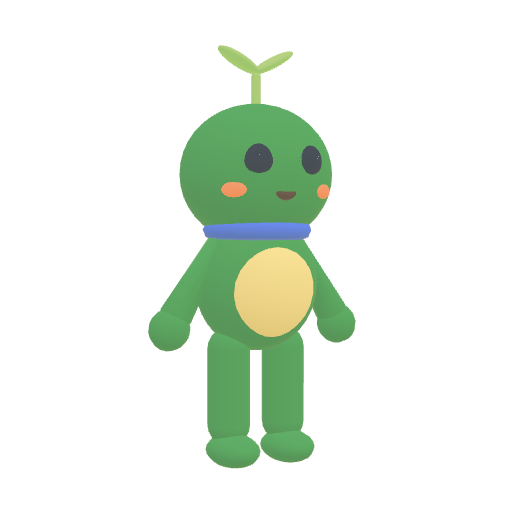
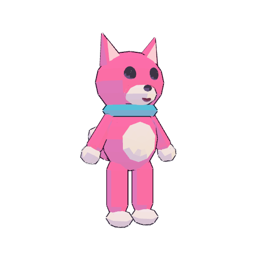
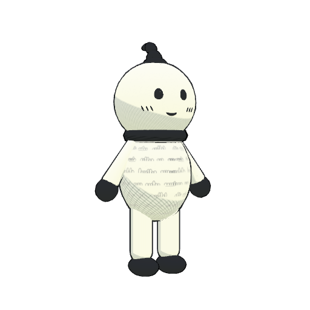
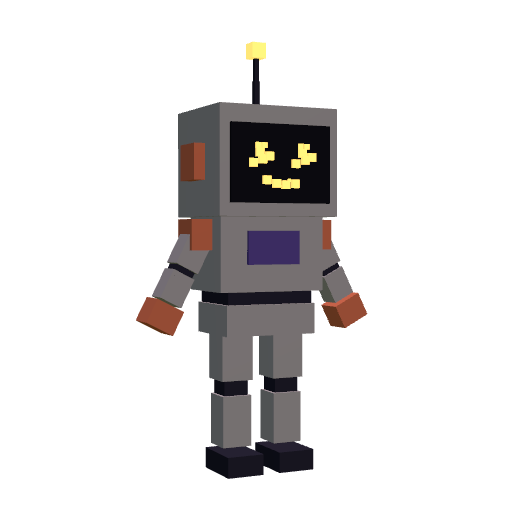

# Avatars

The default avatar set: VRM 1.0 files made in code by [`tools/avatars`](../../tools/avatars), so there are no outside assets and no licence questions. Every avatar is drawn in one style, coloured from that style's palette, and records its style in the file (`scenes[0].extras.superworld`). [`avatars.json`](avatars.json) lists them; `pnpm validate:content` checks each file against it.

| Avatar                                     | Style (form / surface / palette) | What makes it that style                                                                                                                                                             |
| ------------------------------------------ | -------------------------------- | ------------------------------------------------------------------------------------------------------------------------------------------------------------------------------------ |
|  **Sprout** (default) | smooth / soft / meadow           | Rounded shapes, a wide gentle shading gradient, no outlines: the plaza's own look. A leaf sways on spring bones.                                                                     |
|  **Pip**                    | lowpoly / toon / candy           | Few segments and flat facets, hard two-tone cel shading pushed toward the palette's purple, thick outlines. A bouncy tail.                                                           |
|  **Inky**                 | smooth / ink / mono              | Paper-white body painted with handwriting, cross-hatching in the shadows instead of a shade colour, brush outlines that swell and thin, ink-dipped hands and feet, pen-stroke blush. |
|  **Bolt**                 | voxel / pbr / dusk               | Built only from boxes, physically based metal, glass and emissive materials, and an LED dot-matrix face whose pixels rearrange into each expression.                                 |

Every avatar has:

- the VRM humanoid skeleton in T-pose facing +Z, so standard VRM animations play on it;
- every preset expression (`blink`, `blinkLeft`, `blinkRight`, `happy`, `angry`, `sad`, `relaxed`, `surprised`, and the visemes `aa`, `ih`, `ou`, `ee`, `oh`);
- bone look-at for the eyes, and spring bones (leaf, tail, tuft, antenna);
- an `Accent` material that the game tints in the player's colour;
- VRM licence metadata letting anyone use, modify and redistribute it, commercially included, with no credit required.

## Changing or adding an avatar

1. Edit or add a builder in `tools/avatars/` (and list it in `tools/avatars/build.ts`) and an entry in `avatars.json`.
2. `pnpm avatars` builds the VRM files.
3. `pnpm avatars:thumbnails` renders the picker thumbnails with three.js and three-vrm in headless Chromium (set `PLAYWRIGHT_CHROMIUM_PATH` if Playwright's own browser isn't installed; add `--review <dir>` for a sheet of views and every expression), then run `pnpm avatars` again to embed them.
4. `pnpm validate:content`.
