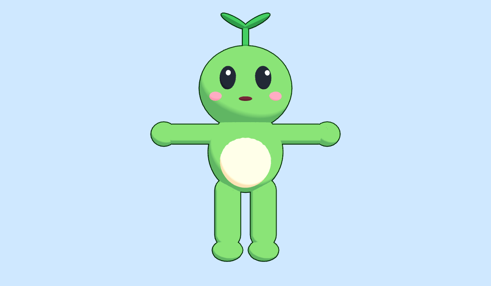

# Avatars

VRM 1.0 avatars for M2.3. Every file here is made in code, so there are no outside assets and no licence questions.

## Sprout



`sprout.vrm` is a cartoon sprout creature, about 1.65 m tall to the leaf tip, built by [`tools/avatars/sprout.ts`](../../tools/avatars/sprout.ts). Rebuild it with `pnpm avatar:sprout`.

- **Skeleton:** the VRM humanoid bones (hips, spine, chest, neck, head, eyes, shoulders, arms, hands, legs, feet) in T-pose facing +Z, so standard VRM animations (`.vrma`) and retargeted clips play on it.
- **Expressions:** all presets as face morph targets — `blink`, `blinkLeft`, `blinkRight`, `happy`, `angry`, `sad`, `relaxed`, `surprised`, and the visemes `aa`, `ih`, `ou`, `ee`, `oh` for lip sync.
- **Look-at:** bone type; the eyes follow a target.
- **Spring bones:** the leaf on its head sways, with a head collider.
- **Materials:** MToon toon shading with outlines; plain colours as the glTF fallback.
- **Budget:** about 14k triangles, 7 materials, no textures, 650 KiB.
- **Licence metadata:** anyone may use, modify and redistribute it, commercially included, with no credit required.

Load it with `@pixiv/three-vrm`:

```ts
const loader = new GLTFLoader();
loader.register((parser) => new VRMLoaderPlugin(parser));
const vrm = (await loader.loadAsync("sprout.vrm")).userData.vrm;
scene.add(vrm.scene);
vrm.expressionManager.setValue("happy", 1);
// every frame: vrm.update(dt);
```
