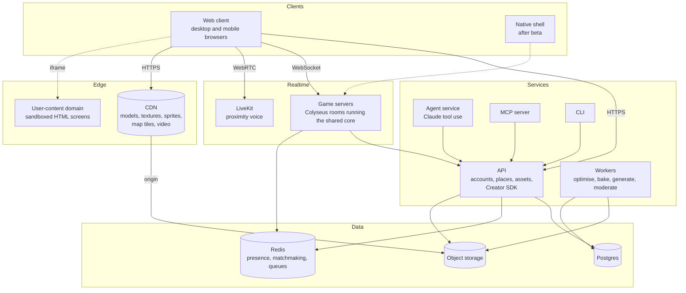
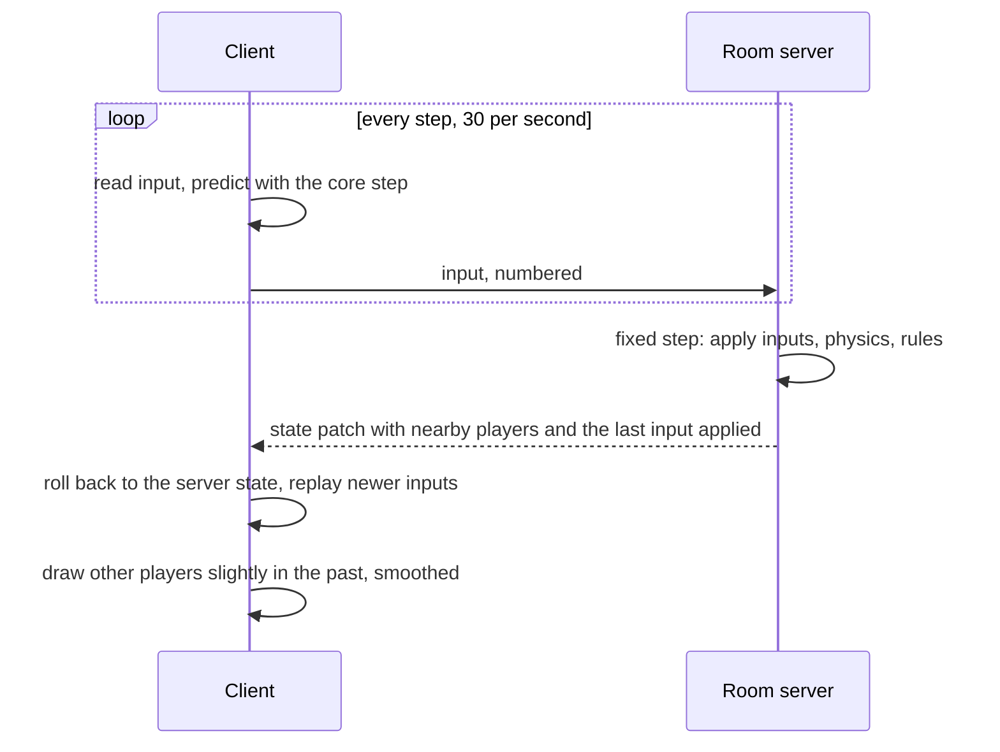
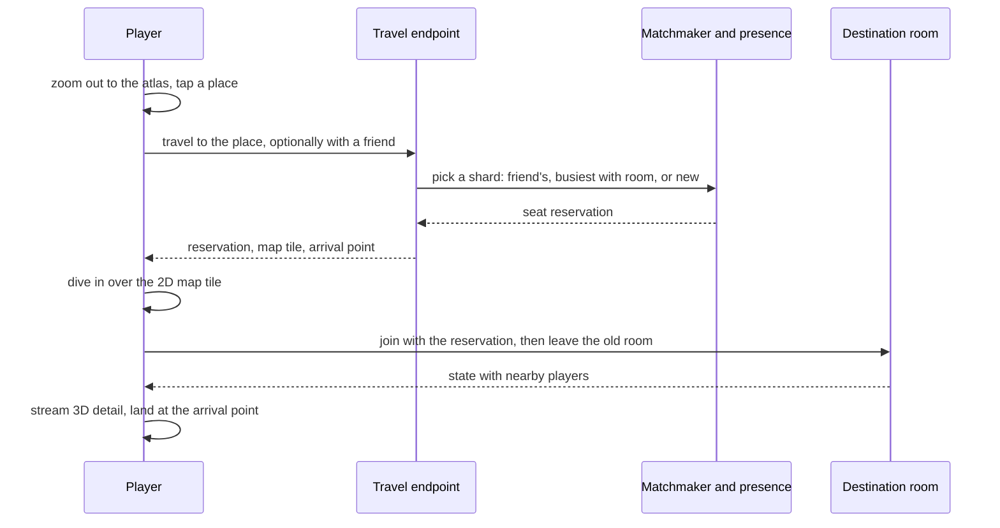
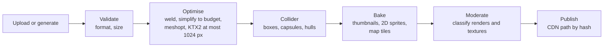
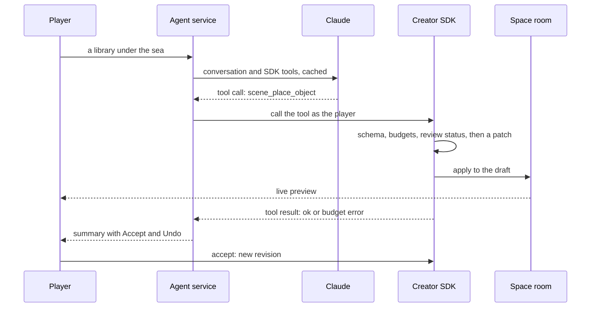

# SuperWorld — World Architecture

> **Status:** draft for review · 3 Oct 2026
> This turns the [SuperWorld plan](../index.html) into a system we can build. Nothing is built yet. [PROCESS_PLAN.md](PROCESS_PLAN.md) sets the build order.

## 1. Principles

The plan's design rules, written as constraints we can check in code review and CI.

| | Principle | In practice |
|---|---|---|
| P1 | **The engine owns how the world runs** | Physics, networking, permissions and budgets are our code. Players and agents author content and settings, never engine code. |
| P2 | **Content is data** | Places, items, avatars and styles are JSON documents checked against one schema package. A new item, track or room never needs an engine release. |
| P3 | **One core everywhere** | The simulation is a TypeScript package with no browser or Node APIs. It runs on the game server, in the browser for prediction, and later in a native app. |
| P4 | **Phone first** | Every feature has to hit its budget in a mid-range phone browser. Desktop gets more detail, not different features. |
| P5 | **The server decides** | Positions, race results, access and edits are decided on the server. Clients predict and draw. |
| P6 | **Checked before shared** | New content is visible to its owner at once, and to anyone else only after automated checks pass. |

## 2. World structure

SuperWorld is a hub with separate places around it, not one seamless map. Each place has its own scene file and its own server rooms. Moving between places is a room switch that the camera zoom hides (plan: *Getting around*).

```text
        ┌─────────────┐                 ┌─────────────┐
        │ Arena       │                 │ Culture     │
        │ races,      │                 │ library,    │
        │ puzzles     │                 │ theatre,    │
        └──────┬──────┘                 │ museum      │
               │                        └──────┬──────┘
               └────────────┐   ┌──────────────┘
                         ┌──┴───┴──┐
                         │  Plaza  │  spawn hub
                         └──┬───┬──┘
               ┌────────────┘   └──────────────┐
        ┌──────┴──────┐                 ┌──────┴──────┐
        │ Private     │                 │ Creator     │
        │ spaces      │                 │ studio      │
        └─────────────┘                 └─────────────┘
```

**Terms**

| Term | Meaning |
|---|---|
| **World** | One manifest listing every public place, its position on the atlas, the portals between places, and the world default style. Lives in `content/world/world.json`. |
| **Place** | Anywhere you can travel to: the plaza, a district, an arena mode, a private space. A place has a stable ID, a link, an access policy and a scene file. |
| **Scene revision** | One immutable version of a place's scene file. A place points at its published revision; every edit makes a new one. |
| **Room** | A live server instance of a place. Busy places run several rooms in parallel (shards). |
| **Entity** | Anything with a position in a room: avatars, placed objects, vehicles, screens. |

**Rooms per place**

| Place | Room type | Players per room | Lifecycle | Phase |
|---|---|---|---|---|
| Plaza | `plaza` | about 50; a new shard opens when one is full | always running | 1 |
| Private space | `space` | set by the owner (default 24) | starts on first visit, stops a minute after the last player leaves | 2 |
| Creator studio | none | just you | runs in the browser and talks only to the generation API | 2 |
| Culture district | `district` | about 50 per shard | always running | 3 |
| Arena mode | `arena_match` | 2–16 | one room per match | 3 |

**Space and links**

- Units are metres, Y is up, the ground is the XZ plane, and facing is a yaw angle around Y (the three.js convention).
- Each place has its own coordinates. Atlas positions are only for drawing the map.
- The server tracks each avatar's ground position, height and facing. That is all a 2D client needs, so 2D and 3D players share rooms (plan: *Devices*).
- Starting size limits, to tune: plaza about 120 m across, districts up to 300 m, private spaces up to 64 m.
- Every place has a link: `/p/<slug>` for public places, `/s/<id>` for private spaces. A link opens in any browser and lands you at the place's arrival point, as a guest if you have no account.
- A link resolves to a shard in this order: a friend's shard, then the busiest shard with room, then a new shard.

## 3. System overview



| Component | Job | Built with | From |
|---|---|---|---|
| Web client | Draw the world, camera, input, HUD; predict your own movement | Vite, three.js (WebGPU with WebGL2 fallback), Preact, `@colyseus/sdk` | Phase 1 |
| Game server | Run authoritative rooms on the shared core | Node 22, Colyseus 0.18, Rapier | Phase 1 |
| API | Accounts, places and revisions, inventory, assets; Creator SDK door 1 | Hono, Drizzle, Postgres | Phase 2 |
| Workers | Optimise and bake assets; run generation and moderation jobs | BullMQ on Redis, glTF-Transform, headless Chromium | Phase 2 |
| Agent service | Building agent and AI hosts | Claude Messages API with tool use | Phase 2 |
| MCP server | Creator SDK door 2, for outside agents | MCP TypeScript SDK | Phase 2 |
| CLI | Creator SDK door 3, for scripts and CI | generated from the SDK | Phase 3 |
| Voice | Proximity voice | LiveKit | Phase 4 |

Phase 1 needs no database. Guests get signed tokens, the plaza scene ships in the repo, and chat is not stored. The first playable build is two things: a static client and one game server.

## 4. Repository layout

```text
apps/
  web/        browser client: boot, HUD, input, net, camera
  server/     game server: Colyseus rooms, travel and guest-token routes
  api/        HTTP API and Creator SDK door 1            (Phase 2)
  agent/      building agent and AI hosts                (Phase 2)
  workers/    asset, bake, generation, moderation jobs   (Phase 2)
  mcp/        MCP server, Creator SDK door 2             (Phase 2)
  cli/        CLI, Creator SDK door 3                    (Phase 3)
packages/
  core/       shared simulation, no browser or Node APIs
  schema/     content formats (Zod), migrations, JSON Schema export
  protocol/   room state, input and message types, protocol version
  style/      style topics and the inheritance resolver
  render/     three.js scene builder, materials, post-effects, quality tiers
  sdk/        Creator SDK tool registry                  (Phase 2)
content/
  world/      world manifest, default style, plaza scene (data, reviewed in PRs)
docs/
  ARCHITECTURE.md, PROCESS_PLAN.md, adr/, plan/ (the plan page)
tools/        content validator, budget checker, load-test bots
```

Dependency rules, checked in CI with dependency-cruiser:

- `schema` depends on nothing of ours. `style` depends only on `schema`.
- `core` depends only on `schema`. Its TypeScript config has no DOM library and no Node types, so a stray `window` or `fs` fails the build.
- `protocol` depends on `core` and `schema`.
- `render` depends on `core`, `schema`, `style` and three.js. three.js is used only in `render` and `apps/web`.
- `sdk` depends on `schema` and `style`.
- Apps depend on packages. Packages never import from apps.

## 5. Content formats

All formats are defined once with **Zod 4** in `packages/schema`. One definition gives us TypeScript types, runtime validation, and JSON Schema, which the MCP server and Claude tool definitions need.

| Document | Holds | Notes |
|---|---|---|
| `World` | places, atlas layout, portals, world default style | one per deployment |
| `Scene` | style, sky and ground, spawn and arrival points, placed instances, screens, portals, access policy | one per place revision |
| `Template` | model asset, collider, one behaviour, style override, stats (triangles, textures), sprite sheet, review status | a reusable object type |
| `Instance` | template reference, transform, overrides | lives inside a scene |
| `StyleProfile` | form, surface, colour, light, atmosphere, post-effects, motion, sound, 2D look; every topic optional | see §10 |
| `Avatar` | VRM asset, sprite sheet, animation set, style | VRM from Phase 2 |
| `Asset` | SHA-256 hash, kind, size, stats, review status | immutable, addressed by hash |

A scene, trimmed:

```json
{
  "schema": "superworld.scene/1",
  "place": "plaza",
  "revision": 3,
  "style": { "light": "noon", "colour": "dusk" },
  "environment": { "sky": "gradient", "ground": { "shape": "disc", "radius": 60 } },
  "spawn": [{ "at": [0, 0, 8], "radius": 6 }],
  "instances": [
    { "id": "fountain", "template": "prim/fountain", "at": [0, 0, 0] },
    { "id": "bench-1", "template": "prim/bench", "at": [10, 0, 4], "yaw": 1.57 }
  ],
  "portals": [{ "id": "to-arena", "target": "arena", "at": [-30, 0, -30] }],
  "access": { "visibility": "public" }
}
```

Rules:

- Every document names its schema and version. Migrations sit next to the schema and run on load, so old revisions always open.
- Assets are addressed by hash and never change. A published revision can't change underneath anyone, and assets can be cached forever.
- IDs are UUIDv7, which sort by time. Public places also get readable slugs.
- The server never opens meshes. The asset pipeline writes each template's collider (boxes, capsules, convex hulls; full meshes only for static ground) into the template, so rooms load only small JSON.
- Places the team builds (plaza, districts) live in `content/` and change through pull requests with CI validation. Player spaces live in the database.

**Every edit is a patch.** Players, the agent, the MCP server and the CLI all edit the same way: a list of JSON Patch operations (RFC 6902) against a scene. The engine checks the result (schema, budgets, permissions, review status of the assets it references) before applying it. One edit path gives us undo and redo, a draft layer for previews, an audit log of who changed what, live updates (rooms broadcast patches instead of reloading), and the history the museum needs to "rewind its making".

## 6. Shared simulation core (`packages/core`)

- **Fixed timestep.** 30 steps a second in hangout rooms, 60 in races. The server and the client run the same step function.
- **Step order.** Inputs → character movement → behaviours → triggers and portals → game-mode rules.
- **Physics.** Rapier through WASM (`@dimforge/rapier3d-compat`), the same build in Node and browsers. Avatars use Rapier's kinematic character controller (walk, run, jump, slopes, steps). If prediction drifts in tests, we switch to Rapier's deterministic build.
- **Avatars pass through each other** in hangout rooms, so nobody can block a door or a spawn point. In rooms where avatars do collide (races, games), arrivals are ghosted for two seconds (plan: *Safe arrival*).
- **Movement intents.** A direction (stick or keys) or a target point (tap to move). Phase 1 steers straight to the target and slides along walls. Phase 2 bakes a navmesh per place with recast-navigation so both sides path around obstacles.
- **Behaviours** are a closed set the engine implements: wear, hold, sit, throw, drive, play, open screen. Data configures them. A new behaviour is an engine release, on purpose (P1).
- **No environment.** Time and randomness are passed in. The package's TypeScript config has no DOM library and no Node types.

## 7. Networking

Built on **Colyseus 0.18**, whose netcode covers what we need: the server runs a fixed-timestep loop over buffered inputs (`setFixedTimestep`, `defineInput`), and the client predicts its own movement with the same step function, then rolls back and replays when server state arrives (`Predict`). Our step function comes from `packages/core`. If `Predict` turns out not to fit our physics step, we write a small reconciler ourselves; the core supports replay either way.



| | Hangout rooms | Race rooms |
|---|---|---|
| Server step | 30 per second | 60 per second |
| Input from each client | every step | every step |
| State patches to each client | 10–20 per second, nearby players only | 20–30 per second, all racers |
| Other players | interpolated about 100–150 ms behind | interpolated, extrapolated briefly |
| Your own avatar | predicted, then reconciled | predicted, then reconciled |

- **Only your own avatar is predicted.** Everything else that moves (other players, physics props, vehicles you don't drive) is interpolated from server state.
- **Nearby-only updates.** Each room keeps a grid of about 24 m cells. A client's `StateView` holds the avatars in its own cell and the eight around it, capped at the 40 nearest on phones. Colyseus notes `StateView` isn't tuned for very large datasets; 50-player shards stay well inside that. Target downstream traffic in a busy plaza: about 20 KB/s per client, measured in M1.6.
- **Shared clock.** `room.clock` gives every client the server's time for theatre screenings, events and race starts.
- **Matchmaking.** One room type per place kind, filtered by place ID. `joinOrCreate` opens a new shard when one fills. "Join a friend" uses the friend's room ID from presence.
- **Other messages** (chat, emote, interact, travel, knock) are checked against shared Zod schemas and rate-limited per client.
- **Cheat checks.** The server caps speed, rejects teleports, clamps out-of-range input, and times races itself.
- **Versions and reconnects.** Clients send their protocol version on join; old clients are asked to reload. A dropped client gets a short window to rejoin its seat.
- **Scale-out (Phase 4).** Redis presence and the Redis driver spread rooms across processes and machines. We switch to the uWebSockets or WebTransport transport only if profiling says to.

## 8. Client (`apps/web`, `packages/render`)

**Boot:** check the device (WebGPU, memory, cores, screen) → pick a quality tier → load the app shell → get a guest token → travel to the link's place → stream the scene.

| Part | How |
|---|---|
| Renderer | three.js `WebGPURenderer`, which falls back to WebGL2 by itself. Materials are written in TSL, so one shader source serves both. |
| Scene builder | Scene document + resolved style → three.js scene: instancing for repeated templates, LODs, impostors for far avatars. |
| Camera | One rig with a continuous height: walk → overview → atlas (§9). |
| Input | Keyboard/mouse and touch adapters produce one input frame: direction or target, look, actions. |
| HUD | Preact with signals, as a DOM layer: chat, emotes, menus, atlas, agent panel. |
| Audio | WebAudio with positional sources. |
| Network | `@colyseus/sdk` with typed state and `Predict`. |
| Install | Web app manifest and service worker, so phones can add SuperWorld to the home screen. |

Renderer, input and audio sit behind small interfaces, so a native client can replace them without touching the core or the protocol.

**Quality tiers** (starting targets, tuned in testing; the client picks a tier at load and drops one if frame time stays over budget):

| | Low: mid-range phone | Medium | High: desktop |
|---|---|---|---|
| Frame rate | 30 fps | 45–60 fps | 60 fps |
| Pixel ratio cap | 1.0 | 1.5 | 2.0 |
| Shadows | blob | blob | real-time, one light |
| Post-effects | none | outline, grain | all |
| Full-detail avatars | 12 nearest | 24 | 40 |
| Draw calls | ≤ 150 | ≤ 300 | ≤ 600 |
| Visible triangles | ≤ 300k | ≤ 700k | ≤ 1.5M |
| Texture memory | ≤ 256 MB | ≤ 512 MB | ≤ 1 GB |

On every tier: about 15k triangles per avatar, textures at most 1024 px in KTX2, at most 5 MB downloaded before the first frame, and the plaza reachable in about 10 seconds on 4G.

From day one: UI text goes through an i18n layer (English first; Japanese is likely, given the launch plan), camera moves respect reduced-motion settings, and every menu works from the keyboard.

## 9. Travel and camera

| Level | View | Control |
|---|---|---|
| Walk | third person, full detail | stick or WASD, drag to look |
| Overview | high angle, a readable board | tap or click to move. 2D mode is this camera kept on. |
| Atlas | the whole world as a map, with friends and live events | tap a place to travel |

Pinch, scroll or `M` moves between levels.



- The old room stays connected until the new seat is reserved, so a failed trip leaves you where you were.
- Each place's map tile is a top-down render made when the place is published. It covers loading and doubles as the 2D background and the atlas picture.
- **Knocking.** Visitors to a private space land at its door. The owner gets the knock and lets them in, which issues a one-time join token.
- **Parties** travel together: the leader's trip sends the same destination to every member.

## 10. Style system

- **Topics:** form, surface, colour, light, atmosphere, post-effects, motion, sound, 2D look.
- **Inheritance:** world default (sets every topic) → district → space → object. Unset topics inherit. The resolver is a pure function in `packages/style`, shared by the client, the studio, the bake workers and SDK validation.
- **Mapping to the engine:**

| Topic | Becomes |
|---|---|
| form | mesh variants and generation hints (low-poly, smooth, voxel…) |
| surface | an entry in the material library (toon, soft, ink, PBR…) |
| colour | palette uniforms |
| light | a light-rig preset and sky |
| atmosphere | fog and particles |
| post-effects | the TSL post-processing chain; skipped on the low tier |
| 2D look | how sprites and map tiles are rendered |

- **When styles meet:** the place owns light, sky and post-effects, so visitors are lit and graded by the place. Owners choose to keep visitors' styles or harmonise them with the place's outline and colour grade. Portals play a short transition between differently styled places. Busy public places use library materials; full custom avatar shaders show in private spaces and up close.

## 11. Avatars and assets

- **Formats:** glTF 2.0 for objects, VRM 1.0 for avatars, KTX2 textures, meshopt geometry compression.
- **Phase 1** uses a procedural mannequin avatar built in code, so there are no outside assets and no licence questions. VRM arrives in Phase 2.



- Bakes run our own renderer in headless Chromium, so sprites and thumbnails match the game.
- **Avatar generation (Phase 2):** describe → concept image to approve → image-to-3D → auto-rig for humanoids → retarget to one skeleton → shrink for phones → VRM 1.0 → checks. Image, mesh and rigging providers sit behind interfaces so we can switch (open decision: hosted APIs such as Meshy or Tripo, or self-hosted Hunyuan3D).
- **VRM notes:** three-vrm 3.x at runtime; VRM extensions must survive optimisation (tooling check in M2.3); cap spring bones in crowds; the style system can override the toon look when a place harmonises.

## 12. Creator SDK and agents

One tool registry, four doors. Each tool is defined once:

```ts
defineTool({
  name: "scene_place_object",   // snake_case works for Claude, MCP and CLI
  module: "scene",
  description: "Place a library or inventory object in the space being edited.",
  input: z.object({ template: TemplateRef, at: Vec3, yaw: z.number().optional() }),
  permission: "space:edit",
  run: (ctx, input) => ({ patches: [/* JSON Patch ops */] }), // never touches a room directly
});
```

…and generated into:

| Door | Form | Phase |
|---|---|---|
| API | `POST /v1/sdk/scene_place_object` | 2 |
| In-game agent | Claude tool definition (JSON Schema from Zod, strict) | 2 |
| MCP | MCP tool, for players' own AI and other apps | 2 |
| CLI | `superworld scene place-object …` | 3 |

Every call, from any door, runs the same checks: sign-in → permission → schema → run → budget check on the patched scene → review status of referenced assets → apply to the draft → broadcast a preview.

| Module | Agent decides | Engine enforces |
|---|---|---|
| scene | place, move and group objects; spawn points, portals | object and triangle budget per space |
| style | any style topic for a space, item or avatar | unset topics inherit; post-effects drop on weak phones |
| lighting | a light-rig preset or custom lights, time of day | light count per tier; shadows on the high tier only |
| materials | pick from the library and tune values | values clamped to safe ranges |
| behaviours | item behaviours (closed set); small scripts from Phase 3 | CPU budget, no network |
| media | screens, music, video (Phase 3) | sandboxed pages, moderation |
| shaders | a node graph from approved nodes (Phase 3) | cost budget, flashing limit, required fallback |

**Agent service**

- A Claude Messages API tool-use loop over the registry's tools. The agent acts as the player, with the player's permissions and nothing more.
- **Model:** the current Opus-tier Claude model by default, with effort set per task: low for small edits, higher for planning a whole room. The plan's "smaller model for routine edits" lever (Sonnet or Haiku tier) is measured with an eval against Opus at low effort before we split traffic, because prompt caches are per model.
- **Caching:** tools are sent in a fixed, sorted order and the system prompt is stable, so each turn re-reads the long prefix at cache prices.
- **Tools** use automatic tool choice with strict schemas, so arguments always validate.
- **Long jobs** such as mesh generation return a job ID. A placeholder appears in the space and is swapped when the job finishes.
- **Every step is previewed**, and the player accepts or undoes it. Budget errors and refusals go back to the model as tool results so it can correct itself.
- **Limits:** daily quotas per player; token and generation spend logged per session for the cost dashboards; conversations kept for safety review (how long depends on the audience-age decision).
- **AI hosts** (curator, marshal, librarian) run in the same service with mostly read-only tools. Offline work such as exhibit descriptions and re-moderation sweeps goes through the Batch API at half price.
- **Rough cost:** a 15-step building session is mostly output tokens (about 20–25k) plus cached context, which comes to well under $1 at today's Opus-tier list prices. M2.6 measures the real number before quotas are set.



**MCP and CLI.** The MCP server uses Streamable HTTP with OAuth and stays internal until the SDK-openness decision. The CLI (Phase 3) covers bulk imports, batch edits and automated tests.

## 13. Sandboxed scripts and shaders (Phase 3)

- **Scripts** run in QuickJS compiled to WASM (`quickjs-emscripten`), on the server and in browsers alike. Each script gets a memory cap, a CPU budget enforced by an interrupt handler, no network, and only the host functions the SDK exposes. Scripts that change shared state run in the server room; cosmetic ones may run in a browser worker.
- **Shaders** are node graphs of approved nodes → compiled to TSL → cost-checked with a test render at the low-tier budget → given a baked fallback for weak phones and 2D → added to the shared library. A flashing limiter and a global kill switch apply. Compute-only nodes are left out because the WebGL2 fallback can't run them.

## 14. Screens (Phase 3)

- **Video** plays as a texture on the screen. Theatre start times live in room state and play against the shared clock, so everyone sees the same frame. Audio is positional.
- **HTML pages** load in a cross-site sandboxed iframe on a separate domain that shares no cookies or storage with the game. The page is laid over the screen when you walk up. Distant screens show a baked snapshot, and phones open the page full screen on tap.
- **Later:** draw HTML into the scene with the HTML-in-Canvas API once it leaves Chrome's origin trial and other browsers adopt it.

## 15. Accounts, social and storage

- **Identity:** guest first (a signed token from the first link, a display name and a colour), then an optional full account (email link or OAuth) to keep spaces and inventory. Joining a room needs a valid token.
- **Social:** friends, parties and presence in our own service on Postgres and Redis pub/sub. We look at Nakama again in Phase 4 if social features outgrow that.
- **Postgres (Phase 2):** users, identities, profiles, avatars, assets, templates, places, place revisions, inventory, friendships, reports, moderation items, generation jobs, usage ledger.
- **Redis:** presence (who is where), the matchmaking driver, rate limits, job queues, leaderboards.
- **Object storage behind a CDN:** hash-addressed, immutable assets with long cache lifetimes.
- **Privacy:** account deletion and data export from the first account release; retention periods for chat and agent logs are set with the audience-age decision.

## 16. Safety and moderation

| What | Check |
|---|---|
| Chat | word filter and rate limits; report, block and mute everywhere |
| Prompts | screened before any generation runs |
| Images and textures | image classifier |
| 3D models | classifier on rendered thumbnails from several angles |
| HTML screens | separate-domain sandbox, URL checks, snapshot classification |
| Publishing | pending → approved automatically, or flagged for a human → approved or rejected. Until it's approved, only the owner sees it. |
| Shaders | flashing cap and a global switch to turn custom shaders off |
| Voice (Phase 4) | muted by default for new and young accounts |
| Edits | the patch log records who made each change: player, agent, MCP or CLI |
| Copyright | takedown process from day one; filters in Phase 4 |

## 17. Observability and cost

- Structured JSON logs, OpenTelemetry metrics and traces, error tracking.
- Sampled client telemetry: frame rate, tier, device, round-trip time.
- A **cost ledger** per player per day: LLM tokens, generation jobs, bandwidth, room CPU time. It feeds the Phase 4 gate ("cost per player within budget").

## 18. Environments

| Environment | What runs | Notes |
|---|---|---|
| Local | `pnpm dev`: Vite client and one game server. From Phase 2, Docker Compose adds Postgres, Redis and MinIO. | Phase 1 needs no cloud accounts |
| Staging | static client on a CDN, game-server containers; managed Postgres, Redis and object storage from Phase 2 | needs a hosting choice (M1.7) |
| Production | game servers in several regions with autoscaling, CDN, LiveKit | Phase 4 |

CI builds the containers. Configuration comes from environment variables; secrets live in the host's secret store.

## 19. Tech stack

Versions are what npm reports on 3 Oct 2026; the lockfile pins exact versions when the repo is scaffolded.

| Area | Choice | Version | Why |
|---|---|---|---|
| Language | TypeScript, strict | 6.0 | typescript-eslint supports up to 6.0; we move to TS 7 (native compiler) when it does |
| Runtime | Node | 22 LTS | |
| Monorepo | pnpm workspaces | 10 | |
| Client build | Vite | 8 | |
| Renderer | three.js `three/webgpu` + TSL | r186 | WebGPU with a built-in WebGL2 fallback |
| Physics | Rapier (`@dimforge/rapier3d-compat`) | 0.21 | the same WASM build on server and client |
| Rooms and netcode | Colyseus, `@colyseus/schema`, `@colyseus/sdk` | 0.18 / 5 / 0.18 | fixed timestep, prediction, per-client filtering |
| UI | Preact + signals | 11 | small and fast on phones |
| Schemas | Zod | 4 | types, validation and JSON Schema from one source |
| Avatars | VRM 1.0 via `@pixiv/three-vrm` | 3.5 | |
| Navmesh | recast-navigation-js | 0.43 | Phase 2 |
| Asset tools | glTF-Transform, KTX2, meshopt | 4.5 | |
| API and database | Hono, Postgres, Drizzle ORM | 4 / – / 0.45 | Colyseus' database package also uses Drizzle |
| Jobs | BullMQ on Redis | 6 | |
| Agent | Anthropic TypeScript SDK | current | Claude tool use |
| MCP | `@modelcontextprotocol/sdk` | 1.32 | |
| Script sandbox | quickjs-emscripten | 0.32 | Phase 3 |
| Voice | LiveKit | – | Phase 4 |
| Tests | Vitest, Playwright, `@colyseus/testing`, `@colyseus/loadtest` | 5 / 1.63 / 0.18 | |
| Lint | ESLint, typescript-eslint, Prettier, dependency-cruiser | 10 / 8 / – / 18 | |

## 20. Decisions and open questions

This document takes these decisions; each becomes a short ADR in `docs/adr/` when the repo is scaffolded:

1. A hub of separate places, not one seamless map. Travel is a room switch.
2. Colyseus 0.18 netcode, with our core's step function shared by server and client.
3. JSON Patch on versioned scene documents is the only way to edit.
4. Zod is the single schema language.
5. No database in Phase 1; persistence arrives with private spaces in Phase 2.
6. Procedural mannequin avatars in Phase 1, VRM 1.0 from Phase 2.
7. TypeScript 6.0 until lint tooling supports 7.
8. QuickJS in WASM for player scripts.

Open questions from the plan, and what each one affects:

| Question | Affects | Needed by |
|---|---|---|
| Audience age: 18+ only, or teens too? | moderation, voice, messaging, log retention | M2.1 |
| Default style | the world default style profile | M1.3 (until then: smooth form and noon light, as in the plan's example) |
| 3D generation: hosted or self-hosted | the M2.7 provider adapter | M2.7 |
| Business model | quotas and credits | Phase 4 |
| SDK openness | when the MCP door opens to players | M2.11 |
| Team and timeline | the durations in the process plan | now, for estimates |
| Hosting | staging and production | M1.7 |
