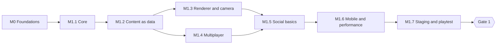

# SuperWorld — Process Plan

> **Status:** draft for review · 3 Oct 2026
> How we build [ARCHITECTURE.md](ARCHITECTURE.md), step by step. Every phase ships something playable and ends at a gate from the [plan](plan/index.html).
>
> **Status (3 Oct 2026):** Phase 1 is complete and live at https://wangdinglu.github.io/SuperWorld/ (solo practice until a game server is connected). Phase 2 has started on `phase-2-ai-creation`: M2.1 (accounts and saved places) is done.

## At a glance

| Phase              | Ships                                                                    | Gate (from the plan)                    | Rough length* |
| ------------------ | ------------------------------------------------------------------------ | --------------------------------------- | ------------- |
| 0 · Foundations    | repo, tooling, CI, docs                                                  | `pnpm dev` runs and CI is green         | 1–2 days      |
| 1 · Walkable world | a shared plaza on phones and laptops                                     | Friends meet on phone and laptop        | 6–8 weeks     |
| 2 · AI creation    | avatars, Creator SDK and agent, private spaces, studio                   | A new player builds a room without help | 12–16 weeks   |
| 3 · Districts      | arena, culture district, screens, atlas, scripts and shaders, moderation | Moderation live for public publishing   | 12–16 weeks   |
| 4 · Public beta    | scale, voice, safety, quotas, cost dashboards                            | Cost per player within budget           | 8–10 weeks    |

\* For a team of 4–6 engineers. These become real estimates once team size is decided (an open decision in the plan).

## How we work

- **Branches.** `master` stays releasable. Work happens on branches and merges through pull requests once CI passes.
- **CI on every push:** install → lint → typecheck → unit tests → build → an end-to-end smoke test in which two browsers join the plaza and see each other. Asset-budget and bundle-size checks join as soon as there's something to measure, plus a nightly room load test.
- **Done means:** it works end to end, tests cover the logic, budgets hold on the low tier, docs and ADRs are updated, and the pull request says how to try it.
- **Decisions** are recorded as one-page ADRs in `docs/adr/`: context, decision, consequences.
- **Playtests** every week from M1.7, on real phones and laptops, with telemetry reviewed alongside.
- **Gates are hard:** the next phase starts only when the current gate passes. Risks are reviewed at every gate.

## Phase 0 · Foundations

**M0 — Repository foundations**

- [x] pnpm workspace: `apps/web`, `apps/server`, `packages/{core,schema,protocol,style,render}`
- [x] TypeScript 6 strict configs; `core` has no DOM library and no Node types
- [x] ESLint, typescript-eslint, Prettier, and dependency-cruiser rules for package boundaries
- [x] Vitest and Playwright, with one smoke test each
- [x] GitHub Actions: lint, typecheck, test, build
- [x] README with run instructions; move the plan page to `docs/plan/`; ADR template and the first ADRs from the architecture doc

_Done when_ a fresh clone runs `pnpm install && pnpm dev` and shows a page from the client connected to the server, and `pnpm check` passes locally and in CI.

## Phase 1 · Walkable world

Deliberately plain: if walking around a plaza with friends isn't fun on a phone, nothing built on top will be (plan: _Roadmap_).

**M1.1 — Shared core**

- [x] Fixed-step loop at 30 Hz, with the clock and randomness passed in
- [x] Rapier world built from collider data; character controller for walking, running, jumping, slopes and steps
- [x] Movement intents: direction (stick, keys) and target point (tap to move, straight steering with wall sliding)
- [x] Tests for movement and collisions, plus a replay test: same inputs, same positions

_Done when_ a headless test walks an avatar around the plaza's colliders and replays it exactly.

**M1.2 — Content as data**

- [x] `schema` v1 in Zod: World, Scene, Template (primitive shapes), Instance, StyleProfile, with JSON Schema export
- [x] `content/world/world.json` and `plaza.scene.json`, built from primitive templates: ground, fountain, benches, trees, lamps, portal arches
- [x] `pnpm validate:content`, also run in CI
- [x] Loaders that turn one scene file into both core colliders (server and client) and a three.js scene (client)

_Done when_ editing `plaza.scene.json` changes both what you see and what you bump into, with no code change.

**M1.3 — Renderer and camera**

- [x] `WebGPURenderer` with WebGL2 fallback; tier detection and the frame-time governor
- [x] `style` resolver v1 and its mapping to light, sky, palette and surface (the outline post-effect moves to M2.9, see ADR-004)
- [x] Procedural mannequin avatar: idle, walk, run, jump and four emotes, coloured per player
- [x] Camera rig: walk ↔ overview with continuous zoom (wheel, pinch, `M`); click or tap to move in overview

_Done when_ one player can walk and tap-to-move around the plaza at 60 fps on desktop and 30 fps on the low tier in device emulation (real phones come in M1.6).

**M1.4 — Multiplayer**

- [x] Colyseus 0.18 `PlazaRoom` running the core with `setFixedTimestep` (30 Hz) and `defineInput`
- [x] Client prediction with `Predict` and the core step; interpolation for other players
- [x] Nearby-only updates with `StateView` and a grid; a new shard at 50 players via `joinOrCreate`
- [x] Protocol version check; reconnect window
- [x] Room integration tests over real WebSockets; a Playwright test where a laptop and a phone see each other and chat

_Done when_ two browsers, one emulating a phone, walk together smoothly with 150 ms of simulated latency.

**M1.5 — Social basics**

- [x] Guest identity: signed token, display name and colour on first visit, name tags
- [x] Chat: speech bubbles and a chat log, rate limit, basic word filter
- [x] Emotes from hotkeys and an emote wheel; local mute and block; a report button (written to server logs until Phase 2)

_Done when_ players can see who's who, chat and emote, and spam gets throttled.

**M1.6 — Mobile and performance**

- [x] Touch controls: virtual stick, one-finger look, tap to move, context button, pinch between camera levels
- [x] Responsive HUD with safe areas; web app manifest and service worker
- [x] Low-tier performance pass: instancing, blob shadows, lazy-loaded 3D engine (LODs and texture budgets arrive with real models in Phase 2)
- [x] Load test with 50 bots per room (`pnpm bots`): about 1.2 ms per server step at 50 players, the 51st player opens a second shard

_Done when_ the plaza holds 30 fps on a mid-range phone with 50 players in the shard (bots), and the room's step time stays within budget.

**M1.7 — Staging and playtest**

- [ ] Deploy the client and game server to staging (needs a hosting choice)
- [x] Shareable place links (`/p/plaza`); telemetry for frame rate, tier, device and round-trip time in the server log (`client-telemetry`)
- [ ] Playtest with friends on phones and laptops; triage the fix list

**Gate 1 — Friends meet on phone and laptop**

- [ ] Friends on phones and laptops find each other from one link and hang out
- [ ] Movement feels responsive up to about 150 ms round trip
- [ ] 30 fps on the target phone
- [ ] The playtest says hanging out is fun, or we fix that before Phase 2

## Phase 2 · AI creation

| Milestone                        | Delivers                                                                                                                                  | Done when                                                                                                 |
| -------------------------------- | ----------------------------------------------------------------------------------------------------------------------------------------- | --------------------------------------------------------------------------------------------------------- |
| M2.1 Persistence and accounts ✅ | Postgres with Drizzle (embedded PGlite for development), guest → member by email link, places and revisions. Object storage moves to M2.2 | a player's data survives a server restart                                                                 |
| M2.2 Asset pipeline              | validate → optimise → collider → bake → moderate → publish jobs                                                                           | an uploaded glTF appears within budget with sprites and a thumbnail; a rejected one never shows to others |
| M2.3 VRM avatars                 | three-vrm, a default avatar set, VRM animation emotes, 2D sprites                                                                         | players pick a VRM avatar and see each other's in 3D and 2D                                               |
| M2.4 Creator SDK v1              | tool registry, patch log, budgets, draft / accept / undo, API door                                                                        | every tool has schema and budget tests; undo restores the exact previous revision                         |
| M2.5 Private spaces              | space rooms that start and stop on demand, access policies, knocking, links, revisions                                                    | a friend knocks, gets let in, and watches edits happen live                                               |
| M2.6 Building agent              | agent panel, Claude tool use over the SDK, async jobs, an eval set, quotas, logs                                                          | one sentence becomes a themed room within budget, and every step can be undone                            |
| M2.7 Avatar generation           | describe → concept → mesh → rig → VRM → checks, behind a provider adapter                                                                 | a sentence becomes a checked, phone-ready VRM avatar                                                      |
| M2.8 Items and behaviours        | templates with wear, hold, sit, throw, play, open screen (drive comes with races in M3.2); inventory                                      | items work in spaces and the plaza without new code per item                                              |
| M2.9 Material library and styles | TSL materials (PBR, toon, glass, water, emissive, hologram) with tier fallbacks; every style topic                                        | the plan's style mixer works on real places                                                               |
| M2.10 Creator studio             | the draft corridor, background generation, steering by talking; keep, save or submit                                                      | an idea becomes a kept draft in a private space                                                           |
| M2.11 MCP door                   | MCP server generated from the registry, with OAuth; internal only                                                                         | an outside agent builds a room using only the MCP server                                                  |

**Gate 2 — A new player builds a room without help.** Proposed bar: at least 8 of 10 first-time testers build and share a room unaided.

## Phase 3 · Districts

| Milestone                      | Delivers                                                                                                                                              |
| ------------------------------ | ----------------------------------------------------------------------------------------------------------------------------------------------------- |
| M3.1 Atlas and fast travel     | atlas, presence (friends, live events, busy spots), map tiles, dive-in transition, party travel                                                       |
| M3.2 Arena                     | game-mode framework; races with vehicles, checkpoints and hidden shortcuts; puzzles; leaderboards timed by the server; tracks built through the SDK   |
| M3.3 Culture district          | library with an AI librarian; theatre with synced screenings; museum with an AI curator that can rewind how a work was made from its revision history |
| M3.4 Screens                   | video, sandboxed HTML on a separate domain, baked snapshots                                                                                           |
| M3.5 Scripts and shaders       | QuickJS sandbox; node-graph shaders → TSL with cost checks, fallbacks, a shared library and a kill switch                                             |
| M3.6 Moderation and publishing | classifiers, review console, takedown process, reports                                                                                                |
| M3.7 CLI door                  | CLI generated from the registry                                                                                                                       |

**Gate 3 — Moderation live for public publishing.** Every public item passes automated review, flagged items reach a human queue, and a takedown has been tested end to end.

## Phase 4 · Public beta

| Milestone               | Delivers                                                                                                                           |
| ----------------------- | ---------------------------------------------------------------------------------------------------------------------------------- |
| M4.1 Scale              | Redis presence and driver, several processes and regions, autoscaling, empty shards sleep; load test to a target player count      |
| M4.2 Voice              | LiveKit proximity voice, muted by default for new and young accounts                                                               |
| M4.3 Safety             | reports and blocking everywhere, age rules, audit tooling                                                                          |
| M4.4 Quotas and credits | daily generation quotas; credits if the business model needs them                                                                  |
| M4.5 Copyright filters  | filters on prompts and generated output                                                                                            |
| M4.6 Cost dashboards    | cost per player per day, with alerts                                                                                               |
| M4.7 Launch             | the launch hunt (hidden door, three gates, live leaderboard), launch night, legal review of the name, trademarks and contest rules |

**Gate 4 — Cost per player within budget**, against a budget you set.

**After beta:** a native app shell (such as Capacitor) on the same core and protocol; a native client only if phones can't hit their targets.

## Risks

| Risk                                                  | Early warning                  | Response                                                                                   |
| ----------------------------------------------------- | ------------------------------ | ------------------------------------------------------------------------------------------ |
| Phones can't hold 30 fps                              | M1.3 emulation, M1.6 devices   | tiers and governor from day one; budgets in CI                                             |
| WebGPU driver bugs on some devices                    | errors grouped by GPU          | force WebGL2 on those devices; TSL keeps one shader source                                 |
| Movement feels laggy on mobile networks               | playtest round-trip and jitter | tune patch rates and interpolation; WebTransport later                                     |
| AI generation too slow or expensive                   | M2.6 and M2.7 cost ledger      | library first, quotas, async jobs with placeholders, effort tuning, batch for offline work |
| Abuse through generated content                       | review-queue volume            | owner-only until checked; classifiers before humans; kill switches                         |
| Scope creep                                           | milestones slipping            | hard gates; Phase 1 stays plain                                                            |
| Name, trademark and contest rules                     | —                              | legal review before launch (plan: _Rules for the ads_)                                     |
| Toolchain churn (TypeScript 7, Vite, Colyseus majors) | an upgrade breaks the build    | pin versions; upgrade in separate PRs                                                      |

## Next steps

1. **M1.7:** deploy with `render.yaml` (Render → New → Blueprint), optionally put the client on Cloudflare Pages, then playtest with friends on phones and laptops.
2. Triage the playtest fix list, then review Gate 1 together before Phase 2 starts.

From here I can't test on real phones (I use device emulation and bots), create hosting accounts, or run playtests. Those parts are yours.

## Decisions

The open ones have defaults and can wait until the milestone that needs them.

| Decision                          | Needed by                        | Default if you don't say                                                                       |
| --------------------------------- | -------------------------------- | ---------------------------------------------------------------------------------------------- |
| Branch and PR flow                | decided                          | one branch per phase, pushed after every milestone; a PR when you ask for one                  |
| Default world style               | M1.3                             | smooth form, noon light (the plan's example)                                                   |
| Hosting for staging               | decided                          | Render free tier for the server and client; Cloudflare Pages optional for the client (ADR-005) |
| Audience age                      | M2.1                             | safe defaults that work for either answer                                                      |
| 3D generation provider            | M2.7                             | hosted API behind an adapter, compared on a test set                                           |
| SDK openness                      | M2.11                            | our own agent first; MCP door internal                                                         |
| Business model, team and timeline | Phase 4; team now, for estimates | not blocking                                                                                   |
